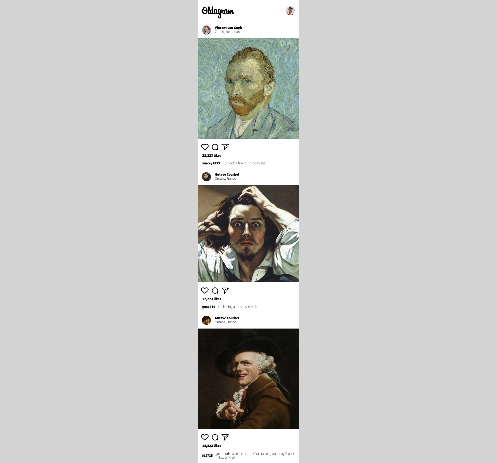

# Oldagram

Oldagram is a mockup of a social media platform's user interface. It's designed to showcase posts and user profiles.



## Table of Contents

- [About](#about)
- [Getting Started](#getting-started)
- [Usage](#usage)
- [Contributing](#contributing)
- [License](#license)

## About

Oldagram provides a basic user interface for a social media platform. It features user profiles with avatars, posts with images, and interactions such as likes and comments.

## Getting Started

To get a copy of the project up and running on your local machine, follow these steps:

### Prerequisites

You need a web browser to view the project.

### Installation

1. Clone the repository:

   ```shell
   git clone https://github.com/yourusername/oldagram.git

Thank you for providing the additional CSS code. Here's an updated README.md template that includes both your HTML and CSS:

```markdown
# Oldagram

Oldagram is a mockup of a social media platform's user interface. It's designed to showcase posts and user profiles.


## Table of Contents

- [About](#about)
- [Prerquisites] (#Prerquisites)
- [Installation] (#installation)
- [Contributing](#contributing)

## About

Oldagram provides a basic user interface for a social media platform. It features user profiles with avatars, posts with images, and interactions such as likes and comments.

### Prerequisites

You need a web browser to view the project.

### Installation

1. Clone the repository:

   ```shell
   git clone https://github.com/yourusername/oldagram.git
   ```

2. Navigate to the project directory:

   ```shell
   cd oldagram
   ```

3. Open `index.html` in your web browser.


## Contributing

Contributions are not currently accepted for this project as it serves as a static mockup.
